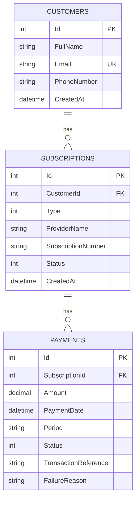
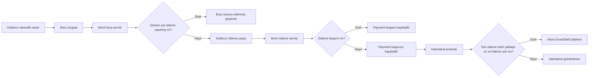

# Abonelik & Otomatik Ödeme Hatırlatma Uygulaması

Bu proje; banka müşterilerinin elektrik, su, internet, GSM gibi düzenli aboneliklerini tanımlayabildiği, borç sorgulayabildiği, ödeme yapabildiği ve ödeme tarihi yaklaşan dönemler için hatırlatma kontrolü çalıştırabildiği full-stack bir örnek uygulamadır.

## Teknolojiler

- Backend: C# / ASP.NET Core Web API (.NET 8)
- ORM: Entity Framework Core
- Veritabanı: Microsoft SQL Server / LocalDB
- Frontend: React + Vite
- Mock üçüncü parti servisler: Borç sorgulama, ödeme, bildirim

## Proje Yapısı

```text
subscription-reminder-app/
├── backend/
│   └── SubscriptionReminder.Api/
│       ├── Controllers/
│       ├── Data/
│       ├── DTOs/
│       ├── Helpers/
│       ├── Models/
│       ├── Services/
│       ├── Program.cs
│       └── appsettings.json
├── frontend/
│   ├── src/
│   ├── package.json
│   └── index.html
├── docs/
│   └── DatabaseSchema.sql
└── README.md
```

## Çalıştırma

### 1. Backend

SQL Server LocalDB kuruluysa `appsettings.json` içerisindeki bağlantı cümlesi doğrudan kullanılabilir.

```bash
cd backend/SubscriptionReminder.Api
dotnet restore
dotnet run
```

API varsayılan olarak şu adreste çalışır:

```text
http://localhost:5000
```

Swagger:

```text
http://localhost:5000/swagger
```

Uygulama ilk açılışta `EnsureCreated()` ile veritabanını oluşturur ve demo müşteri/abonelik verisi ekler.

### 2. Frontend

```bash
cd frontend
npm install
npm run dev
```

Frontend varsayılan olarak şu adreste çalışır:

```text
http://localhost:5173
```

## Temel İş Kuralları

- Bir müşteri birden fazla aboneliğe sahip olabilir.
- Bir abonelik her ay yeniden oluşturulmaz; tekil abonelik kaydı sürekli kullanılır.
- Ödeme dönemi `yyyy-MM` formatındadır.
- Aynı abonelik için aynı dönemde başarılı ödeme varsa ikinci başarılı ödeme engellenir.
- Pasif abonelik için borç sorgulama ve ödeme yapılamaz.
- Hatırlatma kontrolünde, son ödeme tarihi yaklaşan ve ilgili dönem için başarılı ödemesi olmayan aboneliklere mock bildirim gönderilir.

## ER Diagram



## Akış Diyagramı



## API Endpoint Listesi

### Customers

| Method | Endpoint              | Açıklama          |
| ------ | --------------------- | ----------------- |
| GET    | `/api/customers`      | Müşteri listesi   |
| GET    | `/api/customers/{id}` | Müşteri detayı    |
| POST   | `/api/customers`      | Müşteri oluşturma |
| DELETE | `/api/customers/{id}` | Müşteri silme     |

### Subscriptions

| Method | Endpoint                             | Açıklama                        |
| ------ | ------------------------------------ | ------------------------------- |
| GET    | `/api/subscriptions`                 | Abonelik listesi                |
| GET    | `/api/subscriptions?customerId={id}` | Müşteriye göre abonelik listesi |
| GET    | `/api/subscriptions/{id}`            | Abonelik detayı                 |
| POST   | `/api/subscriptions`                 | Abonelik oluşturma              |
| PUT    | `/api/subscriptions/{id}`            | Abonelik güncelleme             |
| DELETE | `/api/subscriptions/{id}`            | Abonelik silme                  |
| GET    | `/api/subscriptions/{id}/debt`       | Mock borç sorgulama             |

### Payments

| Method | Endpoint                                              | Açıklama                                       |
| ------ | ----------------------------------------------------- | ---------------------------------------------- |
| GET    | `/api/payments`                                       | Ödeme listesi                                  |
| GET    | `/api/payments?customerId={id}`                       | Müşteriye göre ödeme listesi                   |
| GET    | `/api/payments/{id}`                                  | Ödeme detayı                                   |
| GET    | `/api/payments/subscription/{subscriptionId}/history` | Abonelik bazlı ödeme geçmişi                   |
| POST   | `/api/payments`                                       | Borç sorgusundan gelen tutarla ödeme oluşturma |

### Reminders & Summary

| Method | Endpoint                                             | Açıklama                                                 |
| ------ | ---------------------------------------------------- | -------------------------------------------------------- |
| GET    | `/api/reminders/customers/{customerId}/check?days=5` | Hatırlatma kontrolü                                      |
| GET    | `/api/customers/{customerId}/summary`                | Aktif abonelik, ödenmemiş abonelik ve son ödemeler özeti |

### Mock Servisler

| Method | Endpoint                  | Açıklama                                 |
| ------ | ------------------------- | ---------------------------------------- |
| GET    | `/api/mock/debts`         | Üçüncü parti borç sorgulama mock servisi |
| POST   | `/api/mock/payments`      | Üçüncü parti ödeme mock servisi          |
| POST   | `/api/mock/notifications` | Email/SMS bildirim mock servisi          |

## Örnek Requestler

### Müşteri Oluşturma

```json
POST /api/customers
{
  "fullName": "Hale Ertem",
  "email": "hale@example.com",
  "phoneNumber": "+905551112233"
}
```

### Abonelik Oluşturma

```json
POST /api/subscriptions
{
  "customerId": 1,
  "type": 3,
  "providerName": "FiberNet Mock",
  "subscriptionNumber": "INT-12345",
  "status": 1
}
```

### Ödeme Yapma

```json
POST /api/payments
{
  "subscriptionId": 1
}
```

## AI Kullanımı

Bu proje geliştirilirken kod iskeleti, dokümantasyon yapısı, API tasarımı ve iş kuralı modellemesi için yapay zekâ desteği alınmıştır. Üretilen kodlar proje gereksinimlerine göre düzenlenmiş; müşteri, abonelik, ödeme dönemi, borç sorgulama, mock ödeme ve hatırlatma ilişkileri tutarlı olacak şekilde kurgulanmıştır.

## Notlar

- UI görselliği ikincil önemdedir; öncelik çalışan ve tutarlı iş akışındadır.
- Mock ödeme servisinde bazı tutarlar bilinçli olarak başarısız dönebilir; başarısız ödemeler de geçmişte saklanır.
- Gerçek banka/kurum entegrasyonu yoktur; üçüncü parti servisler API içinde mock endpoint olarak temsil edilmiştir.
